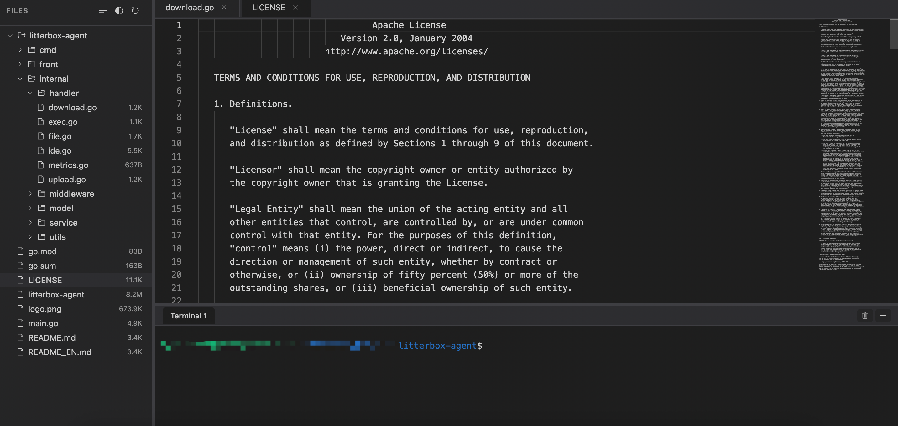

# Litterbox Agent

[](https://go.dev/)
[](https://react.dev/)
[](https://vitejs.dev/)
[](https://microsoft.github.io/monaco-editor/)
[](https://xtermjs.org/)
[](LICENSE)

**中文 | [EN](README_EN.md)**

轻量级沙箱工具，提供 Web IDE 、交互式终端和 API。在浏览器中编辑代码、执行命令、管理文件，同时为 AI Agent 提供完整的自动化接口。专为远程开发和 AI 协作设计。


## 快速开始

### 构建

```bash
# 构建后端
go build -o litterbox-agent cmd/server/main.go

# 构建前端
cd front && npm install && npm run build
```

### 运行

```bash
# 无认证模式
./litterbox-agent

# Token 认证模式
export AGENT_TOKEN="your-secure-token"
./litterbox-agent
```

### 访问

浏览器访问：`http://localhost:22531`

支持 URL 参数：
```
http://localhost:22531?dir=/path/to/directory
http://localhost:22531?dir=/home&file=/home/config.json
http://localhost:22531?token=xxxxxx&dir=/home&file=/home/config.json
```

## 环境变量

| 变量 | 说明 | 默认值 |
|------|------|--------|
| `PORT` | 服务器端口 | `22531` |
| `AGENT_TOKEN` | 访问 Token（不设置则无需认证） | 无 |
| `DEFAULT_DIR` | 默认打开的目录 | 当前工作目录 |

## API 接口

> 如果启用了Token，则需要在请求头中携带 `X-Token`（WebSocket 通过 URL 查询参数 `?token=xxx` 传递）


### 终端 WebSocket

```
WS /ws/terminal?rows=24&cols=80&token=xxxxx
```

### 文件操作

```bash
# 获取文件树
GET /api/tree?path=/path/to/directory

# 读取文件
GET /api/files?path=/path/to/file

# 创建文件/目录
POST /api/files
{"path": "/path/to/file", "is_dir": false}

# 保存文件
PUT /api/files
{"path": "/path/to/file", "content": "file content"}

# 删除文件/目录
DELETE /api/files
{"path": "/path/to/file"}

# 上传文件
POST /api/upload
Content-Type: multipart/form-data

# 下载文件
GET /api/download?path=/path/to/file
```

### 命令执行

```bash
POST /api/exec
{"command": "ls -la", "cwd": "/optional/working/directory"}
```

### 环境变量管理

支持动态管理环境变量，包括 `AGENT_TOKEN`、`DEFAULT_DIR` 等。

```bash
# 列出所有环境变量
GET /api/env

# 获取指定环境变量
GET /api/env?key=AGENT_TOKEN

# 设置环境变量
POST /api/env
{"key": "AGENT_TOKEN", "value": "new-token"}

# 设置默认目录
POST /api/env
{"key": "DEFAULT_DIR", "value": "/home/projects"}

# 删除环境变量
DELETE /api/env?key=AGENT_TOKEN
```

**注意**：
- 修改 `AGENT_TOKEN` 后会立即生效，后续请求需要使用新的 token
- 修改 `DEFAULT_DIR` 后，新打开的页面会使用新的默认目录
- 修改 `PORT` 需要重启服务才能生效

### Agent文件操作

Agent 专用的文件操作接口，支持精确的文件编辑和历史回退。

#### 1. 查看文件内容 (view)

```bash
# 查看整个文件
POST /api/agent/file
{"command": "view", "path": "/path/to/file"}

# 查看指定行范围（例如 1-10 行）
POST /api/agent/file
{"command": "view", "path": "/path/to/file", "view_range": [1, 10]}
```

#### 2. 创建文件 (create)

```bash
POST /api/agent/file
{"command": "create", "path": "/path/to/file", "file_text": "file content"}
```

#### 3. 字符串替换 (str_replace)

```bash
# 替换文件中的所有匹配项
POST /api/agent/file
{"command": "str_replace", "path": "/path/to/file", "old_str": "old text", "new_str": "new text"}
```

#### 4. 插入行 (insert)

```bash
# 在第 5 行之后插入内容
POST /api/agent/file
{"command": "insert", "path": "/path/to/file", "insert_line": 5, "new_str": "new line content"}
```

#### 5. 撤销编辑 (undo_edit)

```bash
# 撤销上一次的编辑操作（每个文件最多保留 10 次历史）
POST /api/agent/file
{"command": "undo_edit", "path": "/path/to/file"}
```

## License

Apache-2.0 license
